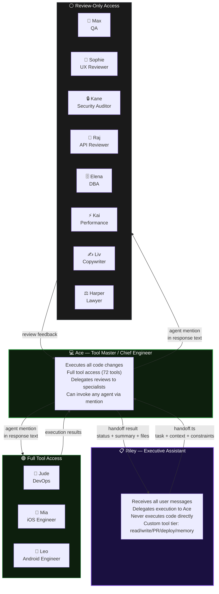
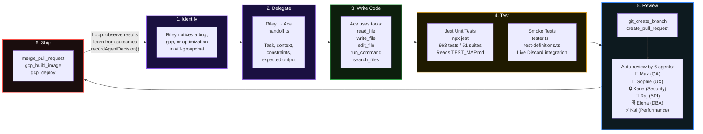
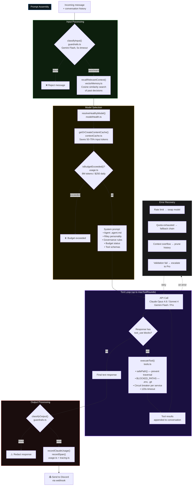

# ASAP Bot — How Riley Self-Improves

## High-Level Architecture

```mermaid
flowchart TB
    subgraph Discord["🎮 Discord Server"]
        direction LR
        GC["💬 #groupchat\n(Riley receives all messages)"]
        subgraph Agents["Agent Channels"]
            direction LR
            R["📋 Riley"]
            A["💻 Ace"]
            MX["🧪 Max"]
            SO["🎨 Sophie"]
            KN["🔒 Kane"]
            RJ["📡 Raj"]
            EL["🗄️ Elena"]
            KI["⚡ Kai"]
            JU["🚀 Jude"]
            LV["✍️ Liv"]
            HA["⚖️ Harper"]
            MI["🍎 Mia"]
            LE["🤖 Leo"]
        end
        subgraph Ops["Ops Channels"]
            direction LR
            T["💻 terminal"]
            L["📊 limits"]
            C["💸 cost"]
            GH["📦 github"]
            UP["🆙 upgrades"]
            AE["🚨 agent-errors"]
        end
    end

    subgraph Routing["📨 Message Routing"]
        GCH["groupchat.ts\nSerialize requests\nRoute agent mentions\nManage workspace threads"]
        TCH["textChannel.ts\nPer-channel queues\nConversation history (20 msgs)\nComplexity classification"]
    end

    subgraph Core["🧠 LLM Orchestration — claude.ts → agentRespond()"]
        direction TB
        G1["1. Input Guardrail\nguardrails.ts"]
        VM["2. Memory Recall\nvectorMemory.ts"]
        MH["3. Model Selection\nmodelHealth.ts"]
        CC["4. Cache Check\ncontextCache.ts"]
        BC["5. Budget Check\nusage.ts"]
        API["6. API Call\nClaude Opus / Sonnet / Gemini"]
        TL["7. Tool Loop (up to maxToolRounds)\ntools.ts — 72 tools"]
        G2["8. Output Guardrail\nguardrails.ts"]
        UR["9. Usage Recording\nusage.ts + tracing.ts"]

        G1 --> VM --> MH --> CC --> BC --> API --> TL
        TL -->|"tool results"| API
        TL --> G2 --> UR
    end

    subgraph Tools["🔧 Tool System"]
        direction LR
        subgraph FileTools["File/Code"]
            FT["read_file\nwrite_file\nedit_file\nrun_command\nrun_tests"]
        end
        subgraph GitTools["GitHub"]
            GT["create_branch\ncreate_pr\nmerge_pr\ngithub_search"]
        end
        subgraph GCPTools["GCP"]
            GCPT["deploy\nbuild_image\nsecrets\nlogs\nrollback"]
        end
        subgraph DBTools["Database"]
            DT["db_query\ndb_schema\nmemory_read\nmemory_write"]
        end
        subgraph DiscTools["Discord"]
            DCT["send_message\nread_messages\nlist_channels\nlist_threads"]
        end
    end

    subgraph Persist["💾 Persistence Layer"]
        direction LR
        PG1[("PostgreSQL\nagent_memory\nConversation history\nUsage counters")]
        PG2[("PostgreSQL + pgvector\nagent_embeddings\n768-dim vectors\nCosine similarity")]
        PG3[("PostgreSQL\ntrace_spans\n7-day retention")]
        GitHub[("GitHub\nBranches & PRs\nCode reviews")]
        GCP[("GCP Cloud Run\nDeploy & rollback\nSecrets & logs")]
    end

    GC --> GCH
    Agents --> TCH
    GCH --> Core
    TCH --> Core
    TL --> Tools
    Tools --> Persist
    Core --> Persist
    UR -.->|"update dashboards"| Ops

    style Discord fill:#1a1f36,stroke:#5865F2,stroke-width:2px,color:#fff
    style Routing fill:#0d1f0d,stroke:#2ea043,stroke-width:2px,color:#fff
    style Core fill:#1f1a00,stroke:#d29922,stroke-width:2px,color:#fff
    style Tools fill:#0d1a1f,stroke:#388bfd,stroke-width:2px,color:#fff
    style Persist fill:#1a1a1a,stroke:#484f58,stroke-width:2px,color:#fff
```

## Agent Hierarchy & Tool Access

## Self-Improvement Loop

## agentRespond() — Detailed Internal Flow

## Key Files Reference

| Layer | File | Purpose |
|-------|------|---------|
| **Entry** | `bot.ts` | Discord client, message routing, startup |
| **Entry** | `setup.ts` | Channel provisioning, structure |
| **Routing** | `handlers/groupchat.ts` | Groupchat orchestration, thread management |
| **Routing** | `handlers/textChannel.ts` | Agent channel handler, history, queues |
| **Core** | `claude.ts` | LLM orchestration, tool loop, model routing |
| **Core** | `agents.ts` | 13 agents, system prompts, registry |
| **Tools** | `tools.ts` | 72 tool definitions, `executeTool()` |
| **Tools** | `toolsDb.ts` | SQL queries, injection prevention |
| **Tools** | `toolsGcp.ts` | GCP operations via `gcloud` CLI |
| **Safety** | `guardrails.ts` | Input/output classification, Gemini Flash |
| **Safety** | `circuitBreaker.ts` | Per-service resilience (open/half-open/closed) |
| **Memory** | `memory.ts` | Conversation persistence, compression |
| **Memory** | `vectorMemory.ts` | Semantic search, pgvector embeddings |
| **Routing** | `handoff.ts` | Agent-to-agent delegation protocol |
| **Infra** | `modelHealth.ts` | Model health tracking, fallback chains |
| **Infra** | `contextCache.ts` | Gemini API prompt caching |
| **Infra** | `usage.ts` | Token/cost tracking, daily budgets |
| **Infra** | `tracing.ts` | OpenTelemetry-style spans |
| **Testing** | `tester.ts` | Live Discord smoke test runner |
| **Testing** | `test-definitions.ts` | Declarative test catalog |
| **Services** | `services/github.ts` | Octokit: branches, PRs, reviews |
| **Services** | `services/cloudrun.ts` | GCP deploy, revisions, rollback |
