# ASAP Bot — How Riley Self-Improves

```mermaid
flowchart TB
    %% ── Discord Layer ──
    User(["👤 Jordan\ntexts Riley in #💬-groupchat\nor talks to Riley in voice"])

    subgraph Discord["🎮 Discord Server"]
        direction LR
        subgraph AgentChannels["Agent Channels"]
            direction TB
            Riley["📋 Riley\nPrimary executor\nLifecycle control"]
            subgraph FullTools["🟢 Full Access"]
                Jude["🚀 Jude · DevOps"]
                Mia["🍎 Mia · iOS"]
                Leo["🤖 Leo · Android"]
            end
            subgraph ReviewTools["⚪ Review Only"]
                Max["🧪 Max · QA"]
                Sophie["🎨 Sophie · UX"]
                Kane["🔒 Kane · Security"]
                Raj["📡 Raj · API"]
                Elena["🗄️ Elena · DBA"]
                Kai["⚡ Kai · Perf"]
                Liv["✍️ Liv · Copy"]
                Harper["⚖️ Harper · Legal"]
            end
            DynAgents["🔀 Dynamic Agents\nRiley creates/destroys\nat runtime · DB-persisted"]
        end
        subgraph OpsChannels["Ops Channels + Queues"]
            terminal["💻 terminal"]
            limits["📊 limits"]
            cost["💸 cost"]
            github_ch["📦 github"]
            upgrades["🆙 upgrades"]
            decisions["📋 decisions"]
            agentErrors["🚨 agentErrors"]
            tools_ch["🔧 tools"]
            callLog["📞 callLog"]
            screenshots["📸 screenshots"]
            url_ch["🔗 url"]
            voiceErrors["🎙️ voiceErrors"]
        end
    end

    %% ── Message Routing ──
    User -->|"text request or couch-mode build goal"| Riley
    Riley -->|"direct execution + focused delegation"| FullTools
    Riley -->|"review requests"| ReviewTools
    ReviewTools -->|"feedback"| Riley
    FullTools -->|"results"| Riley
    Riley -->|"create_agent\nremove_agent\nlist_agents"| DynAgents
    Riley -->|"suggestions, status, loop health\nin #groupchat"| User
    Riley -->|"major decision in groupchat\n=> tag Jordan"| User
    Riley -->|"offline / away decision queue"| decisions

    %% ── Voice System ──
    subgraph Voice["🎙️ Voice — callSession.ts"]
        direction LR
        VoiceIn["ElevenLabs ConvAI\nAnthropic-backed prompts"]
        VoiceCmd["Live Riley voice mode\nanswer · suggest next step\nask for major decision directly"]
        VoiceIn --> VoiceCmd
    end

    User -->|"voice call"| Voice
    VoiceCmd -->|"spoken reply, guidance,\nand direct decision asks"| User

    %% ── LLM Core ──
    subgraph LLM["🧠 claude.ts — agentRespond()"]
        direction TB
        InputGuard["1. Input Guardrail\nguardrails.ts · Anthropic fast model"]
        MemRecall["2. Memory Recall\nvectorMemory.ts · cosine search"]
        SmokeHealth["2b. Smoke Health\ngetLatestSmokeHealthLine()"]
        ModelSelect["3. Model Selection\nservices/modelConfig.ts + modelHealth.ts"]
        CacheCheck["4. Cache Check\ncontextCache.ts · save 50-75% tokens"]
        BudgetCheck["5. Budget Check\nusage.ts · 8M tokens / $250 daily"]
        APICall["6. API Call\nAnthropic model registry\nOpus / Sonnet plug-and-play"]
        ToolLoop["7. Tool Loop\ntools.ts · up to maxToolRounds\ncircuit breaker inlined"]
        OutputGuard["8. Output Guardrail\nguardrails.ts"]
        UsageRecord["9. Record\nusage.ts (includes tracing)"]

        InputGuard --> MemRecall --> SmokeHealth --> ModelSelect --> CacheCheck --> BudgetCheck --> APICall
        APICall --> ToolLoop
        ToolLoop -->|"tool results"| APICall
        ToolLoop --> OutputGuard --> UsageRecord
    end

    Riley --> LLM
    FullTools --> LLM
    ReviewTools --> LLM
    DynAgents --> LLM
    Voice -->|"handleVoiceInput()"| LLM
    UsageRecord -.->|"dashboards"| OpsChannels
    Riley -.->|"text quick actions:\nstatus · loops · limits · threads"| User

    %% ── Tool System ──
    subgraph ToolSystem["🔧 77 Tools"]
        direction LR
        FileOps["📁 File/Code\nread · write · edit\nrun_command\nrun_tests · typecheck"]
        GitOps["🐙 GitHub\nbranch · PR · merge\nreview · search"]
        GCPOps["☁️ GCP\ndeploy · build · rollback\nsecrets · logs"]
        DBOps["🗃️ Database\ndb_query · db_schema\nmemory_read/write"]
        DiscOps["💬 Discord\nsend · read messages\nchannels · threads"]
        LifecycleOps["🔀 Lifecycle\ncreate_agent\nremove_agent · list_agents\nerror_patterns\nrecover_agent_memory"]
    end

    ToolLoop --> ToolSystem

    %% ── Test Engine Loop ──
    subgraph TestEngine["🧪 Test Engine Loop"]
        direction LR
        PRMerge["PR merged\non GitHub"]
        FileMap["mapFilesToCategories()\n24 regex patterns"]
        TargetedSmoke["Targeted smoke\ngetTestsForCategories()"]
        RecordInsight["recordSmokeInsight()\n→ vector memory"]

        PRMerge --> FileMap --> TargetedSmoke --> RecordInsight
    end

    Ship -->|"setSmokeTestCallback"| TestEngine
    RecordInsight -->|"failure → auto-goal"| Identify

    %% ── Self-Improvement Loop ──
    subgraph SelfImprove["🔄 Self-Improvement Loop"]
        direction LR
        Identify["1. Riley spots\nbug or gap"]
        Delegate["2. Riley decides\nexecute vs specialist help"]
        WriteCode["3. Riley writes\ncode via tools"]
        RunTests["4. Test\nJest (unit)\ntester.ts (smoke)"]
        CreatePR["5. PR + Review\n6 agents review"]
        Ship["6. Deploy\nmerge → build\n→ Cloud Run"]

        Identify --> Delegate --> WriteCode --> RunTests --> CreatePR --> Ship
        Ship -->|"observe & learn\nrecordAgentDecision()"| Identify
    end

    Riley -.->|"triggers"| SelfImprove
    WriteCode --> FileOps
    CreatePR --> GitOps
    Ship --> GCPOps

    %% ── Memory Loop ──
    subgraph MemoryLoop["🧠 Memory Loop"]
        direction LR
        Consolidate["consolidateMemoryInsights()\nevery 4 hours"]
        ErrorPatterns["Error Pattern Detection\n3x same error in 1h\n→ auto-learning"]
        Archive["Memory Archival\ndestroy → archived-conv-*\nrecover_agent_memory tool"]

        Consolidate --> ErrorPatterns --> Archive
    end

    %% ── Database Audit Loop ──
    subgraph DatabaseLoop["🗃️ Database Audit Loop"]
        direction LR
        SchemaCheck["Check required runtime tables"]
        MigrationCheck["Read applied_migrations"]
        LegacyCheck["Detect legacy app tables\nwithout mutating schema"]

        SchemaCheck --> MigrationCheck --> LegacyCheck
    end

    %% ── Logging Engine Loop ──
    subgraph LoggingLoop["🪵 Logging Engine Loop"]
        direction LR
        SweepActivity["Read recent agent_activity_log rows"]
        SweepChannels["Read latest ops-channel messages"]
        SweepCloud["Pull Cloud Run / GCP runtime logs"]
        CondenseLogs["Condense DB, Discord, and cloud signals\ninto one Riley-readable report"]

        SweepActivity --> CondenseLogs
        SweepChannels --> CondenseLogs
        SweepCloud --> CondenseLogs
    end

    TestEngine -->|"smoke insights"| MemoryLoop
    MemoryLoop -->|"learnings feed\nagent prompts"| LLM
    agentErrors -->|"error feed"| ErrorPatterns
    DBOps --> DatabaseLoop
    DatabaseLoop -->|"ops summary + warnings"| OpsChannels
    PGActivity --> SweepActivity
    OpsChannels --> SweepChannels
    GCPStore --> SweepCloud
    CondenseLogs -->|"single log view"| Riley

    %% ── Persistence Layer ──
    subgraph Storage["💾 Persistence"]
        direction LR
        PGMemory[("PostgreSQL\nagent_memory\nhistory + usage\n+ dynamic agent registry")]
        PGVector[("pgvector\nagent_embeddings\n768-dim vectors")]
        PGActivity[("PostgreSQL\nagent_activity_log\nerror patterns + events")]
        GitHubStore[("GitHub\nbranches & PRs")]
        GCPStore[("Cloud Run\ndeploy & secrets")]
    end

    DBOps --> PGMemory
    DBOps --> PGVector
    UsageRecord --> PGActivity
    GitOps --> GitHubStore
    GCPOps --> GCPStore
    MemRecall -.->|"embed & search"| PGVector
    ErrorPatterns -.->|"query patterns"| PGActivity
    DynAgents -.->|"persist configs"| PGMemory
    Consolidate -.->|"store insights"| PGVector

    %% ── Styles ──
    style Discord fill:#1a1f36,stroke:#5865F2,stroke-width:2px,color:#fff
    style AgentChannels fill:#1a1f36,stroke:#5865F2,stroke-width:1px,color:#fff
    style OpsChannels fill:#1a1f36,stroke:#484f58,stroke-width:1px,color:#fff
    style FullTools fill:#0d1f0d,stroke:#2ea043,stroke-width:1px,color:#fff
    style ReviewTools fill:#1a1a1a,stroke:#484f58,stroke-width:1px,color:#fff
    style LLM fill:#1f1a00,stroke:#d29922,stroke-width:2px,color:#fff
    style ToolSystem fill:#0d1a1f,stroke:#388bfd,stroke-width:2px,color:#fff
    style SelfImprove fill:#1a1040,stroke:#8957e5,stroke-width:2px,color:#fff
    style TestEngine fill:#0d2a1a,stroke:#2ea043,stroke-width:2px,color:#fff
    style MemoryLoop fill:#2a1a0d,stroke:#d29922,stroke-width:2px,color:#fff
    style DatabaseLoop fill:#0d1f1a,stroke:#2ea043,stroke-width:2px,color:#fff
    style Voice fill:#1a0d2a,stroke:#a371f7,stroke-width:2px,color:#fff
    style Storage fill:#1a1a1a,stroke:#484f58,stroke-width:2px,color:#fff
```

## Main Runtime Loops

There are now 9 notable runtime loops or recurring control cycles:

1. Self-Improvement Loop — Riley identifies work, Ace implements, specialists review, deploy closes the loop.
2. Test Engine Loop — post-merge file mapping triggers targeted smoke coverage and records the result.
3. Logging Engine Loop — structured activity logs plus the latest ops-channel events are condensed into one Riley-readable report.
4. Memory Loop — periodic consolidation plus recurring-error learning feeds future conversations.
5. Database Audit Loop — read-only schema and migration checks post warnings without applying DDL.
6. Channel Heartbeat Loop — stale ops feeds are detected and lightly self-healed.
7. Upgrades Triage Loop — upgrade suggestions are classified, summarized, and top accepted items are dispatched.
8. Voice Session Loop — live call heartbeat plus turn watchdog keeps voice sessions responsive, lets Riley ask for decisions directly, and avoids the decisions channel during active calls.
9. Goal/Thread Watchdog Loop — Riley orchestration monitors stalled goals and thread status over time.

## Text And Voice Use

Riley is the primary interface now. You do not need slash commands to operate the system.

1. Text in #groupchat — ask Riley for status, loops, logs, limits, threads, or give her a build goal. She can use the runtime loops to keep the work moving.
2. Groupchat decisions — if Riley needs a major decision from you in groupchat, the bot tags Jordan directly so the decision is visible immediately.
3. Decisions channel — this remains the queue for overnight or away-from-keyboard decisions.
4. Voice calls — Riley stays in voice, suggests next steps out loud, and asks you directly for major decisions instead of routing you to the decisions channel.

## Validation Pack

If you want to test the architecture through Riley directly, use `.github/RILEY_ARCHITECTURE_PROMPT_PACK.md`.

## Key Files

| Layer | File | Purpose |
|-------|------|---------|
| **Entry** | `bot.ts`, `setup.ts` | Discord client, channel provisioning, startup loops |
| **Routing** | `handlers/groupchat.ts`, `handlers/textChannel.ts`, `rileyInteraction.ts` | Message handling, Riley-native text/voice interaction rules, queues, threads |
| **Core** | `claude.ts`, `agents.ts` | LLM orchestration, 13 static + dynamic agents |
| **Tools** | `tools.ts`, `toolsDb.ts`, `toolsGcp.ts` | 77 tools (includes circuit breaker), SQL safety, GCP ops |
| **Safety** | `guardrails.ts` | I/O classification via Gemini Flash |
| **Memory** | `memory.ts`, `vectorMemory.ts` | Conversation persistence, semantic search, consolidation |
| **Database** | `db/runtimeSchema.ts`, `db/migrate.ts` | Shared schema contract, migrations, read-only DB audits |
| **Infra** | `handoff.ts`, `modelHealthCheck.ts`, `contextCache.ts`, `usage.ts` | Delegation, health, caching, cost tracking + tracing |
| **Testing** | `tester.ts`, `test-definitions.ts` | Smoke tests, test catalog, file→category mapping |
| **Voice** | `handlers/callSession.ts`, `voice/*` | Voice calls, commands, ElevenLabs/Gemini |
| **Ops** | `activityLog.ts`, `services/agentErrors.ts`, `services/opsFeed.ts` | Activity logging, error pattern detection, ops channel posting |
| **Services** | `services/github.ts`, `services/cloudrun.ts` | GitHub PRs, GCP deploy |
| **Config** | `.github/riley-personality.md`, `riley-memory.md`, `discord-server-taste.md` | Agent personality, learned preferences, server recreation guide |

---

## How Riley and the Team Work

This is the non-technical overview diagram.

```mermaid
flowchart TD
    %% ── Entry Points ──
    Jordan(["💬 Jordan texts Riley\nor talks to Riley in voice"])

    subgraph Team["🤖 The AI Team"]
        direction TB
        Riley["📋 Riley — The Manager\nReads the request, decides\nwho should handle it"]
        Ace["💻 Ace — The Builder\nWrites code, runs commands,\nbuilds features"]
        Specialists["👥 11 Specialist Agents\niOS · Android · DevOps\nQA · UX · Security\nAPI · DBA · Perf\nCopywriter · Legal"]
        Dynamic["🔀 On-Demand Agents\nRiley can create new\nspecialists as needed"]
    end

    Jordan -->|"text or voice"| Riley
    Riley -->|"delegates work"| Ace
    Riley -->|"creates/removes"| Dynamic
    Ace -->|"asks for reviews"| Specialists
    Specialists -->|"feedback"| Ace
    Ace -->|"done!"| Riley
    Riley -->|"responds in text or voice"| Jordan
    Riley -->|"tags Jordan in groupchat\nfor major text decisions"| Jordan

    subgraph InteractionModes["🗣️ How Jordan Uses Riley"]
        direction LR
        TextMode["💬 Groupchat\nAsk for build work, status, loops, limits, threads"]
        VoiceMode["🎙️ Voice\nTalk from the couch while Riley plans and builds"]
        DecisionsMode["📋 Decisions Queue\nOnly for offline / away decisions"]
    end

    Jordan --> TextMode --> Riley
    Jordan --> VoiceMode --> Riley
    Riley --> DecisionsMode

    %% ── What Ace Can Do ──
    subgraph Actions["⚡ What Ace Can Do (77 tools)"]
        direction LR
        Code["✏️ Write &\nedit code"]
        GitHub["📦 Create PRs\non GitHub"]
        Deploy["🚀 Deploy to\nthe cloud"]
        Database["🗄️ Query the\ndatabase"]
        Discord["💬 Post to\nDiscord"]
    end

    Ace --> Actions

    %% ── Core Loops ──
    subgraph Loops["🔄 Core Runtime Loops"]
        direction TB

        subgraph Loop1["🔄 Self-Improvement"]
            L1A["Riley spots a problem"]
            L1B["Ace fixes it in code"]
            L1C["Team reviews the fix"]
            L1D["Auto-deploys to production"]
            L1A --> L1B --> L1C --> L1D
            L1D -.->|"learns from result"| L1A
        end

        subgraph Loop2["🧪 Test Engine"]
            L2A["Code gets merged"]
            L2B["Figures out what changed"]
            L2C["Runs targeted tests"]
            L2D["Records what it learned"]
            L2A --> L2B --> L2C --> L2D
            L2D -.->|"failures trigger fixes"| L1A
        end

        subgraph Loop3["🧠 Memory"]
            L3A["Every 4 hours:\nreview all decisions"]
            L3B["Spot error patterns\n(3+ repeats = lesson)"]
            L3C["Store insights for\nfuture conversations"]
            L3A --> L3B --> L3C
            L3C -.->|"smarter responses"| Riley
        end

        subgraph Loop4["🗃️ Database Audit"]
            L4A["Check required tables"]
            L4B["Check applied migrations"]
            L4C["Warn if legacy tables remain"]
            L4A --> L4B --> L4C
        end

        subgraph Loop5["🪵 Logging Engine"]
            L5A["Read DB activity events"]
            L5B["Pull Discord + Cloud Run / GCP logs"]
            L5C["Condense into one view for Riley"]
            L5A --> L5B --> L5C
        end

        subgraph Loop6["🎙️ Voice Session"]
            L6A["Listen to Jordan live"]
            L6B["Riley answers or suggests next step"]
            L6C["Ask for major decisions directly in voice"]
            L6A --> L6B --> L6C
        end
    end

    Actions -->|"changes trigger"| Loops

    %% ── Safety ──
    subgraph Safety["🛡️ Safety & Monitoring"]
        direction LR
        Guard["Every message is\nchecked for safety\nbefore & after AI responds"]
        Budget["Daily spending cap:\n$250 / 8M tokens"]
        Ops["Monitoring channels and loops\ntrack errors, costs,\ndeployments, and runtime health"]
    end

    Riley -.-> Safety

    %% ── Memory ──
    subgraph Memory["💾 The Bot Remembers"]
        direction LR
        Conv["📝 Conversations\nsummarised &\nstored"]
        Learn["🎓 Learnings\nwhat worked,\nwhat didn't"]
        Agents["🔀 Agent configs\nsurvive restarts,\nmemory archived\nnot deleted"]
    end

    Loops -.-> Memory
    Memory -.->|"recalled each\nconversation"| Riley

    %% ── Styles ──
    style Team fill:#1a1f36,stroke:#5865F2,stroke-width:2px,color:#fff
    style Actions fill:#0d1a1f,stroke:#388bfd,stroke-width:2px,color:#fff
    style Loops fill:#1a1040,stroke:#8957e5,stroke-width:2px,color:#fff
    style Loop1 fill:#1a1040,stroke:#8957e5,stroke-width:1px,color:#fff
    style Loop2 fill:#0d2a1a,stroke:#2ea043,stroke-width:1px,color:#fff
    style Loop3 fill:#2a1a0d,stroke:#d29922,stroke-width:1px,color:#fff
    style Safety fill:#2a0d0d,stroke:#f85149,stroke-width:2px,color:#fff
    style Memory fill:#1a1a1a,stroke:#484f58,stroke-width:2px,color:#fff
```

