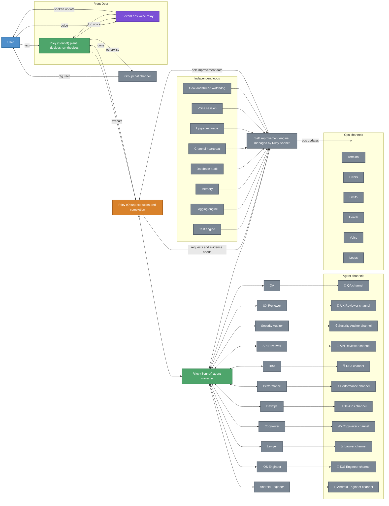
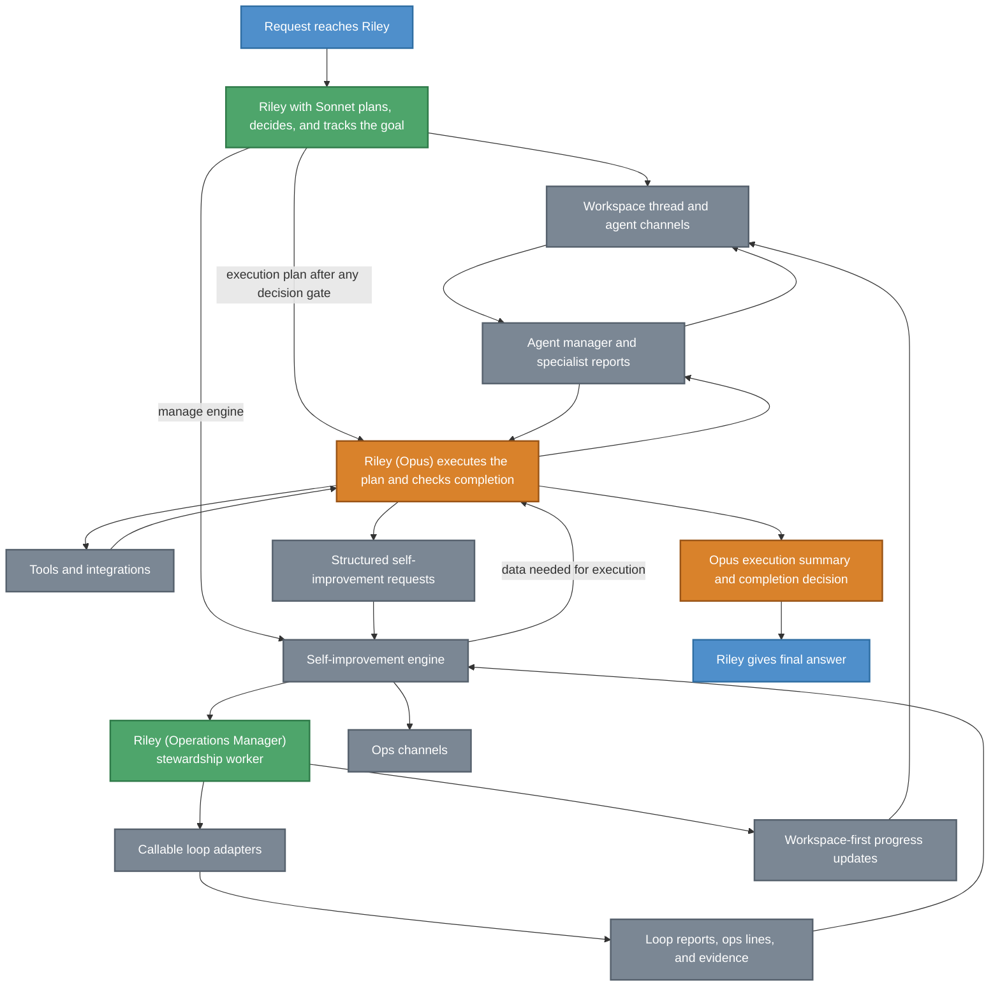

# ASAP Bot - Riley-Centric Architecture

This document describes the target architecture.

Today, the runtime still has some Riley paths locked to Opus. The intended direction is stricter separation: Riley owns planning and synthesis internally with Sonnet, while Opus owns implementation, execution routing, loop invocation, and completion assessment before anything is returned to Riley.

## System Context

## Voice Path

```mermaid
flowchart LR
    UserVoice[User speaks in Discord voice]
    VoiceSession[Discord voice session]
    SpeakerGate[Single-speaker gate]
    SpeechIO[Speech I/O and transcript pipeline]
    Riley[Riley with Sonnet plans, tracks, and responds]
    Workspace[Workspace thread]
    ExecutionFabric[Specialists, tools, and loop adapters]
    SelfImproveEngine[Self-improvement engine]
    OpsSteward["Riley (Operations Manager)\nstewardship worker"]
    Opus["Riley (Opus) executes and checks completion"]
    UserHears[User hears Riley's response]

    UserVoice --> VoiceSession --> SpeakerGate --> SpeechIO --> Riley
    Riley -->|ask for decision while call is live| VoiceSession
    Riley -->|execution needed| Workspace
    Workspace --> Opus
    Opus --> ExecutionFabric
    ExecutionFabric --> Opus
    Riley -->|manage self-improvement path| SelfImproveEngine
    Opus -->|requests and evidence needs| SelfImproveEngine
    SelfImproveEngine -->|stewardship work| OpsSteward
    OpsSteward -->|workspace updates and ops logs| Workspace
    OpsSteward -->|stewardship report| SelfImproveEngine
    SelfImproveEngine -->|loop evidence and ops data| Opus
    Opus -->|completed result| Riley
    Riley -->|short spoken reply| SpeechIO --> VoiceSession --> UserHears

    classDef user fill:#4f8fcb,stroke:#2f6ea3,color:#ffffff,stroke-width:2px;
    classDef riley fill:#4ea56b,stroke:#2f7a49,color:#ffffff,stroke-width:2px;
    classDef opus fill:#d9822b,stroke:#9a5416,color:#ffffff,stroke-width:2px;
    classDef surface fill:#7b8794,stroke:#56616d,color:#ffffff,stroke-width:2px;
    classDef voice fill:#7b4fd6,stroke:#5934a5,color:#ffffff,stroke-width:2px;

    class UserVoice,UserHears user;
    class Riley riley;
    class VoiceSession,SpeechIO,SpeakerGate voice;
    class Opus opus;
    class Workspace,ExecutionFabric,SelfImproveEngine surface;
    class OpsSteward riley;
```

## Execution Path

## Loop Internals

```mermaid
flowchart TB
    Opus[Opus execution summary]
    OpsSteward[Operations manager]
    LoopAdapter[Loop adapter layer]
    LoopOutputs[Loop reports + ops lines + workspace updates]

    Opus -->|steward requests| OpsSteward -->|invoke loops| LoopAdapter

    subgraph RuntimeLoops[All runtime loops in one view]
        subgraph TestLoop[Test engine]
            Test1[Map changed files or regression need]
            Test2[Run readiness or smoke profile]
            Test3[Return pass or fail evidence]
            Test1 --> Test2 --> Test3
        end

        subgraph LoggingLoop[Logging engine]
            Log1[Read recent activity log rows]
            Log2[Read latest ops-channel signals]
            Log3[Publish condensed logging report]
            Log1 --> Log2 --> Log3
        end

        subgraph MemoryLoop[Memory consolidation]
            Memory1[Collect durable insights and repeated failures]
            Memory2[Consolidate useful learnings]
            Memory3[Record learning under operations-manager]
            Memory1 --> Memory2 --> Memory3
        end

        subgraph DbLoop[Database audit]
            Db1[Check expected runtime tables]
            Db2[Check migration and legacy-table state]
            Db3[Return audit result and warnings]
            Db1 --> Db2 --> Db3
        end

        subgraph HeartbeatLoop[Channel heartbeat]
            Heart1[Check status feeds for staleness]
            Heart2[Record loop health and heal if needed]
            Heart3[Post heartbeat result]
            Heart1 --> Heart2 --> Heart3
        end

        subgraph UpgradeLoop[Upgrades triage]
            Up1[Collect upgrade suggestions]
            Up2[Group and rank operational follow-ups]
            Up3[Post triage summary]
            Up1 --> Up2 --> Up3
        end

        subgraph ThreadLoop[Thread status reporter]
            Thread1[Snapshot active workspaces and statuses]
            Thread2[Build condensed thread status line]
            Thread3[Post thread status report]
            Thread1 --> Thread2 --> Thread3
        end

        subgraph WatchdogLoop[Goal and thread watchdog]
            Watch1[Watch long-running goals for stalls]
            Watch2[Attempt recovery or escalate]
            Watch3[Return stall and recovery evidence]
            Watch1 --> Watch2 --> Watch3
        end

        subgraph VoiceLoop[Voice session]
            Voice1[Track active call and current speaker]
            Voice2[Gate to one speaker turn at a time]
            Voice3[Return session health and voice evidence]
            Voice1 --> Voice2 --> Voice3
        end
    end

    LoopAdapter --> Test1
    LoopAdapter --> Log1
    LoopAdapter --> Memory1
    LoopAdapter --> Db1
    LoopAdapter --> Heart1
    LoopAdapter --> Up1
    LoopAdapter --> Thread1
    LoopAdapter -. event-driven .-> Watch1
    LoopAdapter -. event-driven .-> Voice1

    Test3 --> LoopOutputs
    Log3 --> LoopOutputs
    Memory3 --> LoopOutputs
    Db3 --> LoopOutputs
    Heart3 --> LoopOutputs
    Up3 --> LoopOutputs
    Thread3 --> LoopOutputs
    Watch3 --> LoopOutputs
    Voice3 --> LoopOutputs

    LoopOutputs --> Opus

    classDef cortana fill:#4ea56b,stroke:#2f7a49,color:#ffffff,stroke-width:2px;
    classDef opus fill:#d9822b,stroke:#9a5416,color:#ffffff,stroke-width:2px;
    classDef surface fill:#7b8794,stroke:#56616d,color:#ffffff,stroke-width:2px;

    class OpsSteward cortana;
    class Opus opus;
    class LoopAdapter,LoopOutputs,Test1,Test2,Test3,Log1,Log2,Log3,Memory1,Memory2,Memory3,Db1,Db2,Db3,Heart1,Heart2,Heart3,Up1,Up2,Up3,Thread1,Thread2,Thread3,Watch1,Watch2,Watch3,Voice1,Voice2,Voice3 surface;
```

## Core Idea

This file describes the intended Riley-centric control flow for the system.

Riley is the front door to the system.

You interact with Riley in only two ways:

1. Text in Discord.
2. Voice in Discord.

From there, Riley decides what should happen next with Sonnet, tracks the goal inside Riley's own working context, pauses for any required user decision in the right surface, hands execution to Opus only after that gate is satisfied, and then synthesizes the completed result that Opus returns back into one user-facing answer.

## End-To-End Control Flow

1. You speak or type to Riley.
2. Riley receives the request as the single human-facing orchestrator.
3. Riley uses Sonnet internally to decide whether the answer is immediate, requires implementation, or requires one specific loop.
4. For voice, the Discord voice session, speaker gate, and speech I/O pipeline carry the live turn into Riley.
5. If Riley needs a user decision during a live call, Riley asks in voice first; otherwise Riley can still tag the user in the decisions channel and wait for the reply.
6. When execution is needed and any required decision has been received, Riley passes the plan into Opus and keeps the workspace thread active.
7. Opus performs implementation work by calling Riley's Sonnet agent manager, tools, or the loop adapter layer.
8. The agent manager delegates to sub-agents and receives structured JSON reports back from them, including any issues they encountered while doing the work.
9. Opus derives self-improvement requests when logging, memory, regression coverage, or ops reporting follow-up is needed.
10. Riley's Sonnet-side self-improvement manager curates that packet, invokes callable loops, feeds the resulting stewardship data back to Opus, and uses the same engine output to update the ops channels.
11. Agent channels, tools, and loops feed evidence and outcomes back into Opus, and Opus assesses whether the requested work was completed successfully.
12. Opus returns the completed result to Riley.
13. Riley combines that result with user context and chooses the best way to tell the user about completion: voice if they are still in voice, otherwise Riley tags the user in groupchat.

## Workspace Model

The workspace model is Riley-first, Opus-mediated, and agent-second.

1. Riley owns Sonnet-based planning, coordination, and synthesis.
2. Opus owns execution routing once Riley decides work should be carried out.
3. Each agent works in its own dedicated channel or thread, not in one shared execution stream.
4. Agents report their findings, deliverables, or blockers back to Opus through the execution path.
5. Opus decides whether the implementation succeeded and what still remains open.
6. Riley uses the completed result that Opus returns to frame the user-facing response.
7. Riley blocks before Opus execution whenever a tagged user decision is required.

This keeps the human interface simple while still allowing specialized parallel execution behind Riley.

## Voice Model

Voice is not a separate product surface. It is the same Riley control plane expressed through speech.

1. You talk to Riley in voice.
2. The live voice path uses a Discord voice session, a one-speaker gate, and a speech I/O pipeline.
3. Riley plans the response internally with Sonnet before you hear anything back.
4. Riley uses Opus only when execution work is needed.
5. If Riley needs a human decision before execution and the call is still active, Riley should ask in voice first instead of deferring immediately to a text-only decision channel.
6. Opus receives the execution evidence, stewardship reports, and loop results, checks whether the work is complete, and only then returns a result to Riley.
7. When execution completes, Riley decides the best completion channel for the user.
8. If the voice call is still active for the user, Riley can mention the completion in voice.
9. If the user is not in voice, Riley should tag the user in groupchat instead.
10. Riley should be able to continue the same task across voice and text without changing ownership of the task.

The important architectural rule is that voice should not bypass Riley. Voice still enters through Riley, Riley still owns the work, and Riley should only handle one active speaker turn at a time.

Discord already gives the runtime separate speaker streams by member, so distinguishing speakers is feasible today. The missing behavior is orchestration policy: if multiple people speak at once, Riley should tell them she can only handle one speaker at a time and ask them to wait.

## Operations And ASAP Categories

Riley should communicate system state into Discord, not keep it hidden in model responses.

1. Operations channels hold runtime state, logs, alerts, budgets, and loop telemetry.
2. ASAP workspaces hold execution, delegation, and agent collaboration.
3. Riley should surface meaningful status into those categories while work is happening.
4. Riley should use those surfaces to maintain visibility, not just for post-hoc reporting.
5. Final user-facing answers still come from Riley, not directly from workspaces, loops, or Opus.

## Independent Loops

Loops should be independently callable.

They should not all run at once just because Riley is active.

Instead:

1. Riley or Opus decides whether loop execution is needed.
2. Opus derives the needed stewardship request and hands it to Riley (Operations Manager).
3. Operations Manager invokes one specific callable loop through the loop adapter layer.
4. That loop runs independently of the others and posts visible state into Operations surfaces.
5. When the loop completes, it returns a structured report through the execution path back into Opus.
6. Operations Manager can mirror useful progress into the active workspace thread while the loop is running.
7. Opus decides whether that loop result satisfies the goal or whether more execution is needed.
8. Riley uses the completed result that Opus returns to make user-facing decisions or trigger follow-up work.

This makes loops operationally visible and keeps them from becoming an opaque background process.

## Loop Channel Requirements

A dedicated loop channel in Operations should exist for at least these purposes:

1. Show which loop Opus started on Riley's behalf.
2. Show that the loop ran independently.
3. Show whether the loop finished, warned, or failed.
4. Capture the loop's final report in an Opus-readable form.
5. Mirror the most useful progress and outcomes back into the active workspace thread when appropriate.
6. Give Riley a stable reporting surface after Opus has assessed the result.

## Decision Model

Riley remains the human-facing decision point even when other agents or loops contribute.

1. Riley plans and decides.
2. Opus executes, routes work, and decides whether the execution goal was completed successfully.
3. Agents do implementation work inside execution surfaces.
4. Loops produce reports as independent execution units.
5. Riley decides what matters to the user, what to ignore, what to ask you, and how to present the outcome.

That means the system should not respond to you as a loose collection of agents. It should respond as Riley, using the rest of the system as her execution fabric.

## Runtime Surfaces

The architecture depends on these surfaces being explicit:

1. Human interface: groupchat and voice.
2. Voice relay: Discord voice session plus speech I/O.
3. Planning surface: Riley using Sonnet internally.
4. Execution router: Opus.
5. Coordination surface: Riley workspace.
6. Execution surfaces: dedicated agent channels, tools, operations-manager stewardship, and independent loops.
7. Operations visibility: terminal, errors, limits, health, voice, loops, and thread-status channels.
8. Completion surface: Opus taking incoming execution evidence and deciding whether the goal is done.
9. Synthesis surface: Riley taking the completed result and returning one coherent answer.

## Key Files

| Layer | File | Purpose |
|-------|------|---------|
| Entry | `src/index.ts`, `src/discord/bot.ts` | Runtime startup, Discord wiring, top-level event flow |
| Riley routing | `src/discord/handlers/groupchat.ts`, `src/discord/rileyInteraction.ts` | Riley-first planning, interaction policy, and synthesis |
| Voice | `src/discord/handlers/callSession.ts`, `src/discord/voice/connection.ts`, `src/discord/voice/tts.ts` | Voice intake, live session control, single-speaker gating, and speech I/O |
| Model execution | `src/discord/claude.ts`, `src/discord/opusExecution.ts` | Riley planning model selection plus Opus execution routing, stewardship derivation, and completion assessment |
| Agent channels | `src/discord/agents.ts`, `src/discord/handoff.ts` | Agent identities, execution delegation, and channel handoff logic |
| Tools | `src/discord/tools.ts`, `src/discord/toolsDb.ts`, `src/discord/toolsGcp.ts` | Execution surfaces used by Riley and agents |
| Loop orchestration | `src/discord/operationsSteward.ts`, `src/discord/loopAdapters.ts` | Stewardship request derivation and callable loop execution |
| Loop visibility | `src/discord/loopHealth.ts`, `src/discord/loggingEngine.ts` | Loop state tracking, reporting, thread-status, and ops-facing visibility |
| Memory | `src/discord/memory.ts`, `src/discord/vectorMemory.ts` | Riley memory, recall, and self-improvement inputs |

## Architectural Rule Of Thumb

If a task starts with you and ends with a result back to you, Riley should own the full chain:

1. intake,
2. planning,
3. handing execution to Opus when needed,
4. synthesis,
5. response.

Everything else exists to help Riley execute that chain more effectively.
