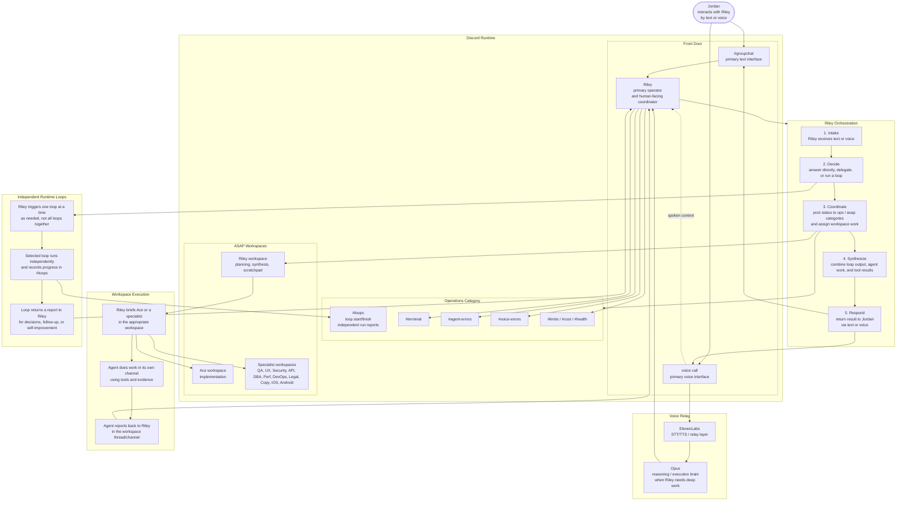

# ASAP Bot - Riley-Centric Architecture

## Core Idea

This file describes the intended Riley-centric control flow for the system.

Riley is the front door to the system.

You interact with Riley in only two ways:

1. Text in Discord.
2. Voice in Discord.

From there, Riley decides whether to answer directly, relay the task through ElevenLabs and Opus, delegate work into agent workspaces, run an independent loop, or combine several of those paths before replying back to you.

## End-To-End Control Flow

1. You speak or type to Riley.
2. Riley receives the request as the single human-facing orchestrator.
3. For voice, ElevenLabs handles the voice relay layer so Riley can hear and speak naturally.
4. When deep reasoning or execution is needed, Riley relays the work to Opus.
5. Riley communicates operational state into the Operations and ASAP Discord categories.
6. Riley uses workspaces to brief agents and manage execution.
7. Agents do their work inside their respective channels or threads, then report back to Riley in the workspace context.
8. Riley combines agent output, loop output, and her own reasoning.
9. Riley responds back to you through text or voice.

## Workspace Model

The workspace model is Riley-first, agent-second.

1. Riley owns planning, coordination, and synthesis.
2. Riley uses the workspace to communicate with agents.
3. Each agent works in its own dedicated channel or thread, not in one shared execution stream.
4. Agents report their findings, deliverables, or blockers back to Riley.
5. Riley decides what to do next with those results.

This keeps the human interface simple while still allowing specialized parallel execution behind Riley.

## Voice Model

Voice is not a separate product surface. It is the same Riley control plane expressed through speech.

1. You talk to Riley in voice.
2. ElevenLabs provides the live voice relay layer.
3. Riley can send the actual reasoning or execution workload to Opus when needed.
4. Riley returns the result to you in natural voice.
5. Riley should be able to continue the same task across voice and text without changing ownership of the task.

The important architectural rule is that voice should not bypass Riley. Voice still enters through Riley, and Riley still owns the work.

## Operations And ASAP Categories

Riley should communicate system state into Discord, not keep it hidden in model responses.

1. Operations channels hold runtime state, logs, alerts, budgets, and loop telemetry.
2. ASAP workspaces hold execution, delegation, and agent collaboration.
3. Riley should surface meaningful status into those categories while work is happening.
4. Riley should use those surfaces to maintain visibility, not just for post-hoc reporting.

## Independent Loops

Loops should be independently callable.

They should not all run at once just because Riley is active.

Instead:

1. Riley chooses a specific loop based on the current need.
2. That loop runs independently of the others.
3. The loop posts start, progress, and finish state into a dedicated Operations loop channel.
4. When the loop completes, it returns a report back to Riley.
5. Riley uses that report to make decisions, trigger follow-up work, or improve future behavior.

This makes loops operationally visible and keeps them from becoming an opaque background process.

## Loop Channel Requirements

A dedicated loop channel in Operations should exist for at least these purposes:

1. Show which loop Riley started.
2. Show that the loop ran independently.
3. Show whether the loop finished, warned, or failed.
4. Capture the loop's final report in a Riley-readable form.
5. Give Riley a stable reporting surface for self-improvement decisions.

## Decision Model

Riley remains the decision point even when other agents or loops contribute.

1. Agents do work.
2. Loops produce reports.
3. Opus performs deep reasoning when Riley escalates work to it.
4. Riley decides what matters, what to ignore, what to ask you, and what to do next.

That means the system should not respond to you as a loose collection of agents. It should respond as Riley, using the rest of the system as her execution fabric.

## Runtime Surfaces

The architecture depends on these surfaces being explicit:

1. Human interface: groupchat and voice.
2. Voice relay: ElevenLabs.
3. Deep reasoning: Opus.
4. Coordination surface: Riley workspace.
5. Execution surfaces: dedicated agent channels.
6. Operations visibility: terminal, errors, limits, health, voice, and loops channels.
7. Synthesis surface: Riley taking all incoming evidence and returning one coherent answer.

## Key Files

| Layer | File | Purpose |
|-------|------|---------|
| Entry | `src/index.ts`, `src/discord/bot.ts` | Runtime startup, Discord wiring, top-level event flow |
| Riley routing | `src/discord/handlers/groupchat.ts`, `src/discord/rileyInteraction.ts` | Riley-first orchestration for text and interaction policy |
| Voice | `src/discord/handlers/callSession.ts`, `src/discord/voice/connection.ts`, `src/discord/voice/tts.ts` | Voice intake, live session control, ElevenLabs-backed speech I/O |
| Model execution | `src/discord/claude.ts`, `src/services/modelConfig.ts` | Opus/Sonnet model routing and tool-driven execution |
| Agent workspaces | `src/discord/agents.ts`, `src/discord/handoff.ts` | Agent identities, delegation, and workspace handoff logic |
| Tools | `src/discord/tools.ts`, `src/discord/toolsDb.ts`, `src/discord/toolsGcp.ts` | Execution surfaces used by Riley and agents |
| Loop visibility | `src/discord/loopHealth.ts`, `src/discord/loggingEngine.ts` | Loop state tracking, reporting, and ops-facing visibility |
| Memory | `src/discord/memory.ts`, `src/discord/vectorMemory.ts` | Riley memory, recall, and self-improvement inputs |

## Architectural Rule Of Thumb

If a task starts with you and ends with a result back to you, Riley should own the full chain:

1. intake,
2. delegation,
3. loop triggering,
4. synthesis,
5. response.

Everything else exists to help Riley execute that chain more effectively.
