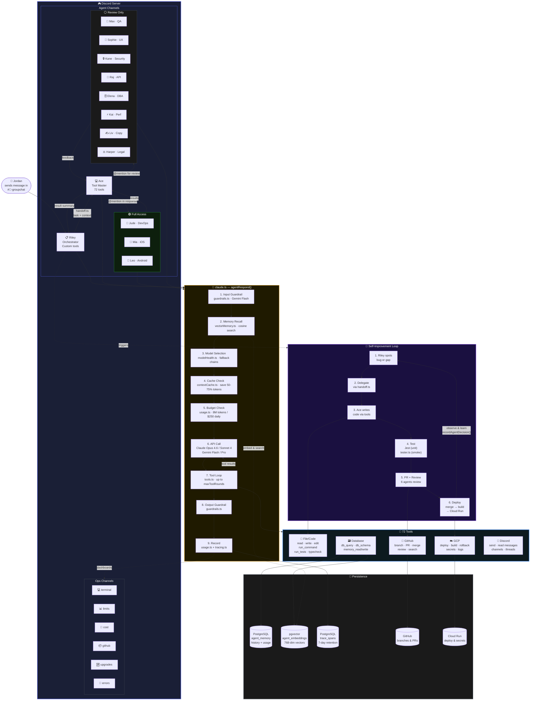

# ASAP Bot — How Riley Self-Improves

## Key Files

| Layer | File | Purpose |
|-------|------|---------|
| **Entry** | `bot.ts`, `setup.ts` | Discord client, channel provisioning |
| **Routing** | `handlers/groupchat.ts`, `handlers/textChannel.ts` | Message handling, queues, threads |
| **Core** | `claude.ts`, `agents.ts` | LLM orchestration, 13 agent definitions |
| **Tools** | `tools.ts`, `toolsDb.ts`, `toolsGcp.ts` | 72 tools, SQL safety, GCP ops |
| **Safety** | `guardrails.ts`, `circuitBreaker.ts` | I/O classification, resilience |
| **Memory** | `memory.ts`, `vectorMemory.ts` | Conversation persistence, semantic search |
| **Infra** | `handoff.ts`, `modelHealth.ts`, `contextCache.ts`, `usage.ts`, `tracing.ts` | Delegation, health, caching, cost, traces |
| **Testing** | `tester.ts`, `test-definitions.ts` | Smoke tests, test catalog |
| **Services** | `services/github.ts`, `services/cloudrun.ts` | GitHub PRs, GCP deploy |
