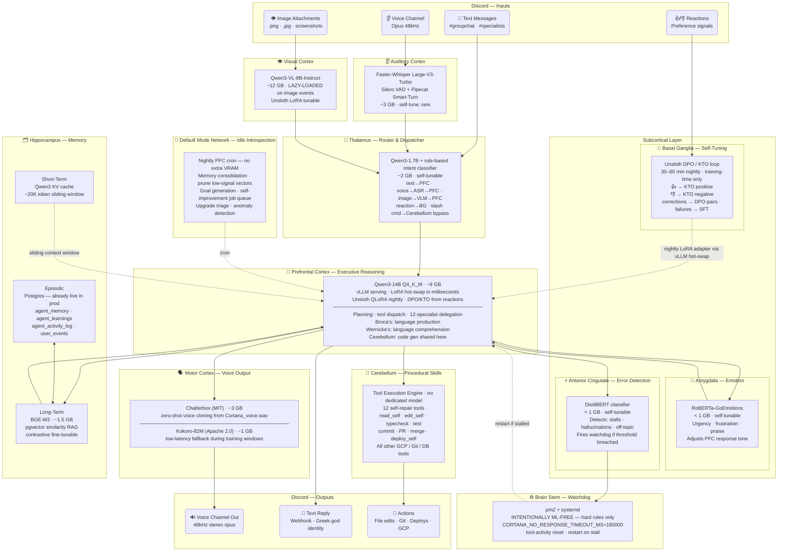

# Cortana Brain Architecture

Open-source model stack mapped to human brain regions. Discord is her only sensory surface.

---

---

## VRAM Budget — RTX 3090 / 4090 (24 GB)

| Model | Brain Region | VRAM | Always-on |
|---|---|---|---|
| Qwen3-14B Q4_K_M | PFC + Language | ~9 GB | ✅ |
| Faster-Whisper Large-V3-Turbo | Auditory Cortex | ~3 GB | ✅ |
| Chatterbox | Motor Cortex (voice) | ~3 GB | ✅ |
| Qwen3-1.7B | Thalamus router | ~2 GB | ✅ |
| BGE-M3 | Hippocampus long-term | ~1.5 GB | ✅ |
| RoBERTa-GoEmotions | Amygdala | <1 GB | ✅ |
| DistilBERT | ACC error detector | <1 GB | ✅ |
| KV cache + CUDA overhead | — | ~3 GB | ✅ |
| **Total always-on** | | **~23 GB** | ✅ fits 24 GB |
| Qwen3-VL-8B | Visual Cortex | ~12 GB | ❌ lazy-load — swap Whisper+TTS off temporarily |

---

## Self-Tuning Flywheel

| Trigger | Data | Technique | Tool | Time |
|---|---|---|---|---|
| 👍/👎 reactions | Binary signals | KTO | Unsloth | nightly |
| User corrections | (bad, good) pairs | DPO | Unsloth | nightly |
| Tool failures | Error→fix examples | SFT | Unsloth | nightly |
| RAG misses | Hard negatives | Contrastive | Unsloth | weekly |
| Image corrections | Caption pairs | VLM LoRA | Unsloth | weekly |
| Voice reference update | New voice clip | Zero-shot | Chatterbox | seconds |

New adapter promoted via `vLLM /v1/load_lora_adapter` — **no bot restart**.
