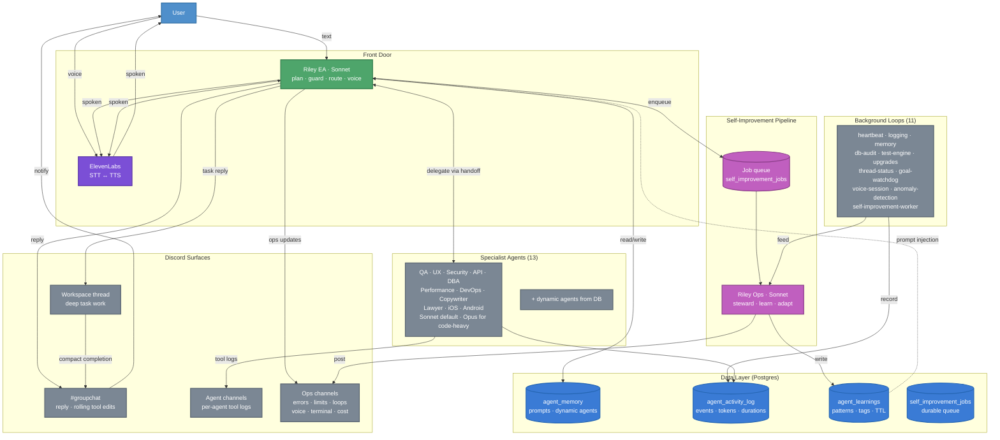

# ASAP Discord

ASAP Discord is a Discord-based AI workspace.

Instead of opening a dozen tools, tabs, and dashboards, I can talk to Riley in Discord and she coordinates the rest of the team. In the target architecture, Riley is the planning and interface layer, Opus is the execution layer, agent channels are execution surfaces, and operations channels keep the whole system visible while it runs.

This repo is the runtime behind that system.

## What It Does

- Lets me run software projects from Discord through text or voice.
- Gives Riley a team of specialist agents for coding, QA, DevOps, security, legal, design, API review, database work, and more.
- Supports "couch mode": I can sit in voice and ask Riley to plan, build, explain, or ask me for decisions directly.
- Tracks activity, cost, errors, memory, and health automatically, with one condensed log sweep Riley can read.
- Runs smoke tests after important changes and learns from repeated failures.
- Keeps an overnight decision queue so work can continue while I am away.
- Includes a career-ops workflow for job search, job scoring, drafting, and application support.

## Why It Is Different

Most AI demos stop at "chat with one assistant".

This system is closer to an operations room:

- Riley EA is the front door and sole orchestrator.
- Riley plans, delegates to specialists via handoff, and synthesizes the result.
- Specialists run on Sonnet by default, Opus for code-heavy work.
- Agent work happens in dedicated workspace threads and agent channels.
- The system monitors itself while it works.

## Architecture

### How to read this diagram

**Front Door.** All user input (text or voice) enters through Riley EA, which always runs on Sonnet. Riley applies guardrails, answers simple questions directly, and delegates to specialists when focused review is needed. Voice goes through ElevenLabs for STT/TTS.

**Delegation.** Riley EA is the sole orchestrator. Her JSON response envelope includes a `delegateAgents` list; `handleSubAgents()` runs those specialists in tiered parallel via the handoff protocol. Results are aggregated back to Riley for synthesis. There is no separate "agent manager" — Riley EA plans, delegates, and synthesizes in one flow.

**Model routing.** `resolveModelForAgent()` picks the model per-call: Riley EA and Riley Ops always use Sonnet (`RILEY_PLANNING_MODEL`). Code-heavy agents (EA, Ops, DevOps, iOS, Android) get Opus on high-stakes prompts. All others get Sonnet with health-based fallback. There is no separate "Opus agent" — Opus is a model choice, not an entity.

**Specialist Agents.** 13 static agents (QA, UX, Security, API, DBA, Performance, DevOps, Copywriter, Lawyer, iOS, Android, plus Riley EA and Riley Ops) and dynamic agents loaded from `agent_memory`. Each specialist works in a dedicated Discord channel.

**Self-Improvement Pipeline.** After specialist work completes, a self-improvement packet is built and enqueued as a durable job. A 5-second poll worker claims the job, runs loop adapters, dispatches to Riley Ops (the operations-manager agent), and writes learnings to the database. Failed jobs post to #errors. Accepted upgrades from the triage loop also become jobs.

**Background Loops (11).** Channel heartbeat (30m), logging engine (30m), memory consolidation (4h), database audit (6h), test engine (on-demand), upgrades triage (6h), thread status reporter (1h), goal watchdog (60s), voice session (20s), anomaly detection (30m), self-improvement worker (5s). Each reports health status to the ops dashboard.

**Data Layer.** Four Postgres tables: `agent_memory` (system prompts and dynamic agent definitions), `agent_activity_log` (event-sourced telemetry), `agent_learnings` (patterns with tags and 30-day TTL, injected into future system prompts), and `self_improvement_jobs` (durable job queue with retry/backoff).

**Feedback loop.** Loops detect issues → worker records learnings → learnings are injected into future prompts → agents adapt behavior. This is the closed loop that makes the system learn from its own operation.

The full architecture with per-channel contracts is in [.github/ARCHITECTURE.md](.github/ARCHITECTURE.md).

An animated walkthrough is in [assets/architecture-runtime-animated.html](assets/architecture-runtime-animated.html).

## Main Features

- Text-first control in Discord group chat.
- Voice-first control for live conversations via ElevenLabs STT/TTS.
- Direct user tagging when Riley needs an important decision.
- 13 static specialist agents plus dynamic agents that Riley can create at runtime.
- Automated smoke testing after important changes.
- Read-only database audits to catch schema drift safely.
- Shared agent learnings: patterns discovered by any agent are written to `agent_learnings` with tags and 30-day TTL, then injected into future system prompts.
- Anomaly detection: error-rate spikes, token-cost trends, latency degradation, and rate-limit frequency are detected and posted to ops channels.
- Durable self-improvement queue with retry/backoff and terminal-failure notifications.
- Rolling-update tool notifications that edit a single message in place instead of posting batches.
- Usage and budget tracking built into the runtime.
- GitHub, deployment, screenshot, and diagnostics integrations.

## The 11 Runtime Loops

These loops are the part I would usually show an employer because they explain why the bot is more than a chat wrapper.

1. **Channel heartbeat** (30 min): the bot watches its own status feeds and notices when one goes stale.
2. **Logging engine** (30 min): Riley gets one condensed view of recent activity-log events and the latest ops-channel signals.
3. **Memory consolidation** (4 h): useful decisions and repeated failure patterns get turned into future context. Deduplicates and expires stale learnings.
4. **Database audit** (6 h): the runtime checks that the expected tables, migrations, and indexes are present.
5. **Test engine** (on demand): after code changes, the system maps the changed files to the right smoke tests.
6. **Upgrades triage** (6 h): suggestions are collected, grouped, and surfaced back to Riley. Accepted upgrades now create durable self-improvement jobs.
7. **Thread status reporter** (1 h): the runtime snapshots active workspaces and posts condensed thread status.
8. **Goal watchdog** (60 s): the system watches long-running tasks so work does not silently stall.
9. **Voice session** (20 s heartbeat): live voice calls stay responsive and Riley asks for decisions in voice.
10. **Anomaly detection** (30 min): queries the activity log for error-rate spikes, token-cost trends, latency degradation, and rate-limit frequency. Posts anomalies to #errors and records learnings.
11. **Self-improvement worker** (5 s poll): drains the durable job queue, runs loop adapters, dispatches to the Operations Manager, and writes learnings back to the database.

Self-improvement is managed by Riley the agent manager as a packet-driven engine. Riley (Operations Manager) is the background stewardship worker. The runtime persists that work in Postgres (`self_improvement_jobs`), drains it off the main user path, and writes what it learns to `agent_learnings` for future prompt injection.

## Token And Cost Optimisation

The system does not just send everything to the biggest model every time. It tries to stay useful and efficient.

- Context caching: the infrastructure exists for prompt reuse, but the current provider (Anthropic) does not expose a compatible API. The code gracefully falls back to a no-op until provider support is available.
- Short handoffs: agent-to-agent context is trimmed so specialists do not get giant history dumps.
- Smaller replies for voice: live voice answers are intentionally brief to reduce delay and cost.
- Prompt breakdown tracking: the runtime measures how much of each request is system instructions, history, tools, user message, and tool output.
- Tool-result truncation: large raw outputs are shortened before they become future prompt context.
- Model routing: cheaper or faster models handle routine work; stronger models are used when the task needs them.
- Conversation limits: very long threads get warnings before they become too expensive or messy.
- Cache hit tracking: the runtime measures cache use so prompt efficiency can be improved over time.

## Estimated Cost

These are rough estimates based on the runtime's current built-in accounting model, not a hard promise. Real cost depends on model choice, prompt size, tool output size, and whether voice is active.

### Current Internal Pricing Assumptions

- Claude input: about `$15` per 1 million tokens.
- Claude output: about `$75` per 1 million tokens.
- Claude cached reads: about `$1.50` per 1 million tokens.
- Gemini text input: about `$0.20` per 1 million tokens.
- Gemini text output: about `$1.27` per 1 million tokens.
- Gemini voice/transcription call: about `$0.0001` per call.
- ElevenLabs speech: about `$0.00018` per spoken character.

### What That Means In Practice

- A short Gemini text reply can be well under one tenth of a cent.
- A short Claude text reply is usually a few cents, not fractions of a cent.
- A medium coding or planning turn can land around `5` to `15` cents if it uses a larger model and a lot of context.
- Voice is usually more expensive than text because speech generation adds extra cost on top of the language model.

### Example Estimates

- Short status reply on Gemini, around `1,000` input tokens and `200` output tokens: about `$0.0005`.
- Short status reply on Claude with the same size: about `$0.03`.
- Medium planning or coding reply on Claude, around `4,000` input tokens and `600` output tokens: about `$0.10`.
- One spoken Riley answer of about `120` characters with ElevenLabs: about `$0.02`, plus a very small amount for the language model and transcription.
- A short back-and-forth voice session can easily land in the `20` to `50` cent range if it includes a lot of spoken replies.

The runtime also has a daily budget gate and usage dashboard, so it can stop itself before cost runs away.

## Before Using It In Discord

The code is ready. The last things to check are environment and infrastructure.

1. Make sure the database is reachable from the machine running the bot.
2. Run the migrations before first use.
3. Set the required Discord bot token and guild ID.
4. Set a Gemini key for non-voice model features that still use Gemini.
5. Add ElevenLabs for voice transcription and speech.
6. Start the bot and run a smoke test.

### Current Status Of This Repo

From this workspace, I could not apply the SQL migration because Postgres is not reachable on `localhost:5432`.

That means the remaining blocker is environment access, not application code.

## What Employers Usually Care About Here

- Multi-agent orchestration instead of a single chat bot.
- Text and voice interfaces for the same system.
- Self-monitoring runtime loops.
- Built-in cost controls and token efficiency tracking.
- Real operational tooling: GitHub, deployment, diagnostics, screenshots, database checks.
- Thoughtful safety design around budgets, guardrails, and human decisions.

## Tech Snapshot

- TypeScript
- Node.js
- Discord.js
- PostgreSQL
- Google Cloud Run
- Anthropic + Gemini + ElevenLabs

## If You Want The Technical View

- Full technical architecture: [.github/ARCHITECTURE.md](.github/ARCHITECTURE.md)
- Repo map: [.github/REPO_MAP.md](.github/REPO_MAP.md)
- Project context: [.github/PROJECT_CONTEXT.md](.github/PROJECT_CONTEXT.md)
