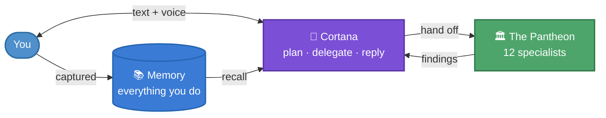

<div align="center">

# ASAP Discord

**A Discord-native AI workspace.**
Talk to Cortana in text or voice. She plans, delegates to a team of specialist agents, and keeps the whole operation visible while it runs.

[Features](#features) · [How it works](#how-it-works) · [Quickstart](#quickstart) · [Tech](#tech)

</div>

---

## What it is

One chat-based assistant you actually trust with real work.

Ask Cortana anything in Discord — text or voice — and she handles it. For deep work she hands off to a team of 12 specialists (all Greek gods, each with their own voice and role). You see exactly what they're doing the whole time, in one live-updating message.

## Features

- **Text and voice.** Type in Discord or join the voice channel — same brain either way.
- **A real team.** 12 specialists (QA, security, DBA, DevOps, mobile, legal, …) Cortana can delegate to.
- **Everything you say gets remembered.** Text, voice, screenshots, reactions — all indexed so she can recall context later.
- **Non-blocking decisions.** She asks for your call in `#decisions`, keeps working on her best guess, and adapts the moment you click a button.
- **Live status, one message.** Every turn is one evolving message showing who's doing what, not a wall of notifications.
- **Self-improving.** Background loops catch errors, cost spikes, and anomalies and feed the lessons back into future prompts.
- **Budget-safe.** Daily cap + live usage tracking so cost can't run away unattended.

## How it works



**Cortana is the only one you talk to.** She plans, decides what needs a specialist, calls them, and brings back one clean answer. Specialists work in their own Discord channels; you see Cortana's synthesis.

### The Pantheon

| Deity | Role |
|---|---|
| 🎯 **Cortana** | Executive assistant — front door for everything |
| 🧪 **Argus** | QA — catches everything (hundred-eyed watcher) |
| 🎨 **Aphrodite** | UX reviewer |
| 🔒 **Athena** | Security auditor |
| 📡 **Iris** | API reviewer (messenger of the gods) |
| 🗄️ **Mnemosyne** | DBA (titaness of memory) |
| ⚡ **Hermes** | Performance (swift-footed) |
| 🚀 **Hephaestus** | DevOps (forge, builder) |
| 🍎 **Artemis** | iOS engineer |
| 🤖 **Prometheus** | Android engineer |
| ✍️ **Calliope** | Copywriter (muse of eloquence) |
| ⚖️ **Themis** | Lawyer (goddess of law) |

Plus any number of **dynamic agents** Cortana can spin up at runtime for one-off needs.

## Cost

Built-in daily budget gate + live usage dashboard. Real cost depends on how you use it:

| Scenario | Approximate cost |
|---|---|
| Short text reply | fractions of a cent |
| Medium coding turn | ~10 ¢ |
| One spoken answer | ~2 ¢ |
| Short back-and-forth voice session | 20–50 ¢ |

## Quickstart

You need:

- Postgres reachable from wherever the bot runs
- Discord bot token + guild ID
- Gemini API key (for non-voice features)
- ElevenLabs credentials (for voice)

Then:

```bash
npm install
npm run migrate      # sets up the database
npm start            # runs the bot
```

## Tech

TypeScript · Node.js · Discord.js · PostgreSQL + pgvector · Google Cloud Run · Anthropic · Gemini · ElevenLabs

## Deeper docs

- [Architecture](.github/ARCHITECTURE.md) — the full runtime, loops, and data layer
- [Repo map](.github/REPO_MAP.md) — what's where in the code
- [Project context](.github/PROJECT_CONTEXT.md) — design decisions and history
- [Animated walkthrough](assets/architecture-runtime-animated.html)
