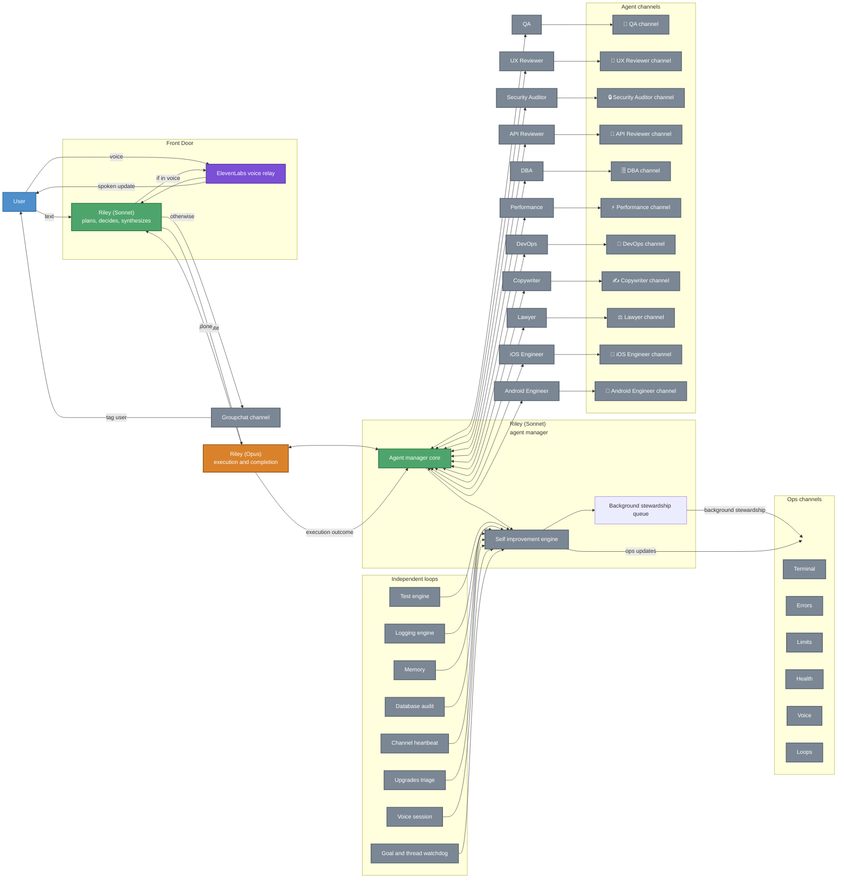

# ASAP Discord

ASAP Discord is a Discord-based AI workspace.

Instead of opening a dozen tools, tabs, and dashboards, I can talk to Riley in Discord and she coordinates the rest of the team. In the target architecture, Riley is the planning and interface layer, Opus is the execution layer, agent channels are execution surfaces, and operations channels keep the whole system visible while it runs.

This repo is the runtime behind that system.

## What It Does

- Lets me run software projects from Discord through text or voice.
- Gives Riley a team of specialist agents for coding, QA, DevOps, security, legal, design, API review, database work, and more.
- Supports "couch mode": I can sit in voice and ask Riley to plan, build, explain, or ask me for decisions directly.
- Tracks activity, cost, errors, memory, and health automatically, with one condensed log sweep Riley can read.
- Runs smoke tests after important changes and learns from repeated failures.
- Keeps an overnight decision queue so work can continue while I am away.
- Includes a career-ops workflow for job search, job scoring, drafting, and application support.

## Why It Is Different

Most AI demos stop at "chat with one assistant".

This system is closer to an operations room:

- Riley is the front door.
- Riley plans and synthesizes the work.
- Opus handles implementation and execution routing.
- Agent work happens in dedicated workspaces.
- The system monitors itself while it works.

## Simple Diagram

This diagram shows the target architecture. Riley's Sonnet agent manager sends work to sub-agents and manages the self-improvement engine as a separate manager-owned layer. Opus emits execution outcomes back to the manager, the manager queues stewardship in the background, and the loops feed evidence into that manager-owned path without holding the user turn open.

The full architecture diagram is in [.github/ARCHITECTURE.md](.github/ARCHITECTURE.md).

## Main Features

- Text-first control in Discord group chat.
- Voice-first control for live conversations.
- Direct user tagging when Riley needs an important decision.
- Dynamic agents that Riley can create and remove at runtime.
- Automated smoke testing after important changes.
- Read-only database audits to catch schema drift safely.
- Memory that improves future responses over time.
- Usage and budget tracking built into the runtime.
- GitHub, deployment, screenshot, and diagnostics integrations.

## The 9 Runtime Loops

These loops are the part I would usually show an employer because they explain why the bot is more than a chat wrapper.

1. Test engine loop: after code changes, the system maps the changed files to the right smoke tests.
2. Logging engine loop: Riley gets one condensed view of recent activity-log events and the latest ops-channel signals.
3. Memory consolidation loop: useful decisions and repeated failure patterns get turned into future context.
4. Database audit loop: the runtime checks that the expected tables and migrations are present.
5. Channel heartbeat loop: the bot watches its own status feeds and notices when one goes stale.
6. Upgrades triage loop: suggestions are collected, grouped, and surfaced back to Riley.
7. Thread status reporter loop: the runtime snapshots active workspaces and posts condensed thread status.
8. Goal and thread watchdog loop: the system watches long-running tasks so work does not silently stall.
9. Voice session loop: live voice calls stay responsive and Riley asks for decisions in voice.

Self-improvement still exists, but it is now managed by Riley the agent manager as a packet-driven engine. Riley (Operations Manager) is the background stewardship worker inside that path. The current runtime now queues that work off the main user request path; a durable outbox is the next hardening step.

## Token And Cost Optimisation

The system does not just send everything to the biggest model every time. It tries to stay useful and efficient.

- Context caching: repeated context can be reused instead of fully re-sent. The codebase describes this as saving roughly 50% to 75% of tokens in the right situations.
- Short handoffs: agent-to-agent context is trimmed so specialists do not get giant history dumps.
- Smaller replies for voice: live voice answers are intentionally brief to reduce delay and cost.
- Prompt breakdown tracking: the runtime measures how much of each request is system instructions, history, tools, user message, and tool output.
- Tool-result truncation: large raw outputs are shortened before they become future prompt context.
- Model routing: cheaper or faster models handle routine work; stronger models are used when the task needs them.
- Conversation limits: very long threads get warnings before they become too expensive or messy.
- Cache hit tracking: the runtime measures cache use so prompt efficiency can be improved over time.

## Estimated Cost

These are rough estimates based on the runtime's current built-in accounting model, not a hard promise. Real cost depends on model choice, prompt size, tool output size, and whether voice is active.

### Current Internal Pricing Assumptions

- Claude input: about `$15` per 1 million tokens.
- Claude output: about `$75` per 1 million tokens.
- Claude cached reads: about `$1.50` per 1 million tokens.
- Gemini text input: about `$0.20` per 1 million tokens.
- Gemini text output: about `$1.27` per 1 million tokens.
- Gemini voice/transcription call: about `$0.0001` per call.
- ElevenLabs speech: about `$0.00018` per spoken character.

### What That Means In Practice

- A short Gemini text reply can be well under one tenth of a cent.
- A short Claude text reply is usually a few cents, not fractions of a cent.
- A medium coding or planning turn can land around `5` to `15` cents if it uses a larger model and a lot of context.
- Voice is usually more expensive than text because speech generation adds extra cost on top of the language model.

### Example Estimates

- Short status reply on Gemini, around `1,000` input tokens and `200` output tokens: about `$0.0005`.
- Short status reply on Claude with the same size: about `$0.03`.
- Medium planning or coding reply on Claude, around `4,000` input tokens and `600` output tokens: about `$0.10`.
- One spoken Riley answer of about `120` characters with ElevenLabs: about `$0.02`, plus a very small amount for the language model and transcription.
- A short back-and-forth voice session can easily land in the `20` to `50` cent range if it includes a lot of spoken replies.

The runtime also has a daily budget gate and usage dashboard, so it can stop itself before cost runs away.

## Before Using It In Discord

The code is ready. The last things to check are environment and infrastructure.

1. Make sure the database is reachable from the machine running the bot.
2. Run the migrations before first use.
3. Set the required Discord bot token and guild ID.
4. Set a Gemini key for language and transcription.
5. Add ElevenLabs if you want the best voice experience.
6. Start the bot and run a smoke test.

### Current Status Of This Repo

From this workspace, I could not apply the SQL migration because Postgres is not reachable on `localhost:5432`.

That means the remaining blocker is environment access, not application code.

## What Employers Usually Care About Here

- Multi-agent orchestration instead of a single chat bot.
- Text and voice interfaces for the same system.
- Self-monitoring runtime loops.
- Built-in cost controls and token efficiency tracking.
- Real operational tooling: GitHub, deployment, diagnostics, screenshots, database checks.
- Thoughtful safety design around budgets, guardrails, and human decisions.

## Tech Snapshot

- TypeScript
- Node.js
- Discord.js
- PostgreSQL
- Google Cloud Run
- Anthropic + Gemini + ElevenLabs + Deepgram

## If You Want The Technical View

- Full technical architecture: [.github/ARCHITECTURE.md](.github/ARCHITECTURE.md)
- Repo map: [.github/REPO_MAP.md](.github/REPO_MAP.md)
- Project context: [.github/PROJECT_CONTEXT.md](.github/PROJECT_CONTEXT.md)
